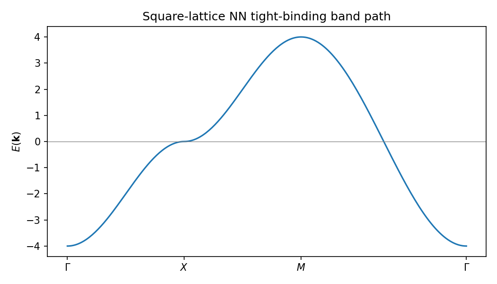
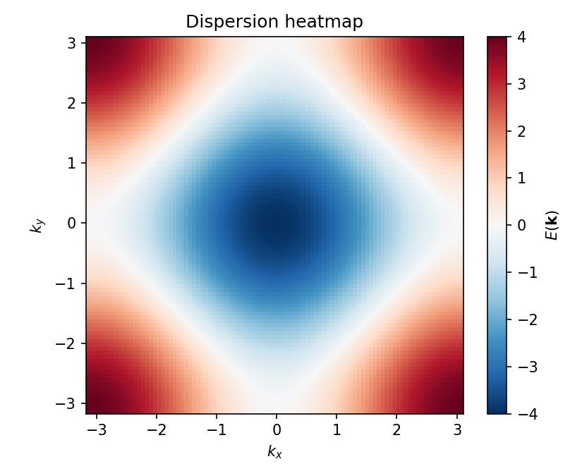
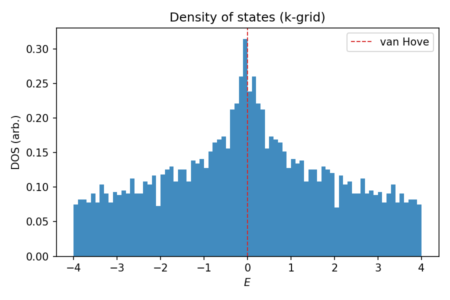
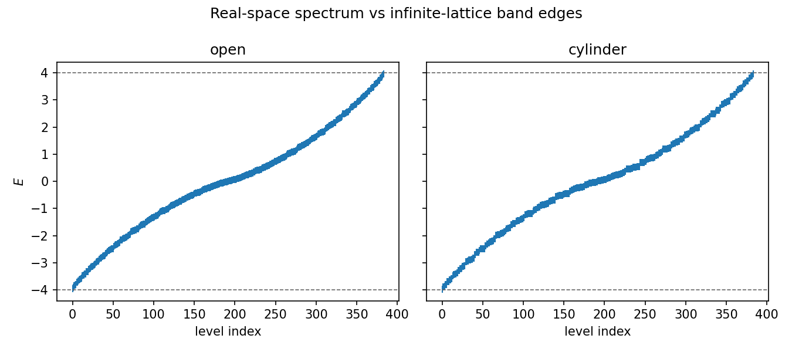
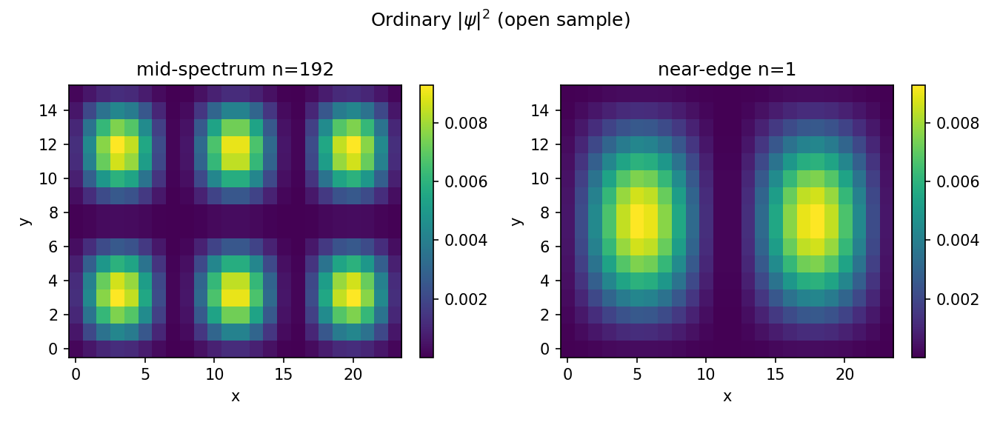

# Part 1 — The quote, and a lattice you already know

In *Avengers: Endgame*, Tony Stark jokes about eigenvalues of an inverted Möbius strip. A Möbius strip cannot be inverted by a continuous deformation of its embedding. A Chern insulator cannot be inverted either: flipping the sign of its topological invariant is a jump, not a smooth change. This series puts those two facts together — but first we need a lattice Hamiltonian you already know how to build.

By the end of this part you will write a square-lattice tight-binding (TB) model in momentum space, plot its dispersion and density of states, and diagonalize the same model on a finite open rectangle and on a cylinder.

## Nearest-neighbor hopping on the square lattice

Consider one orbital per site on the square lattice with hopping amplitude $t$. In Bloch language the dispersion is

$$
E(\mathbf{k}) = -2t\bigl(\cos k_x + \cos k_y\bigr).
$$

With $t=1$, the band runs from $-4$ to $+4$. The extrema sit at the Brillouin-zone (BZ) corners you expect from solid-state class: $\Gamma=(0,0)$ has $E=-4$, $M=(\pi,\pi)$ has $E=+4$, and the zone-edge points $X=(\pi,0)$ and $(0,\pi)$ are saddles at $E=0$. Those saddles produce van Hove peaks in the density of states (DOS).

From the run that produced these figures (`results/01_dispersion.json`): $E_\Gamma=-4$, $E_X=0$, $E_M=+4$, and the DOS piles up near the van Hove energy. No topology language yet — just a band you can trust.

**Reproduce:** `python experiments/01_square_tb_dispersion.py`

## The same model in real space

Later parts live almost entirely in real space: finite rectangles, cylinders, and eventually a Möbius strip. Experiment 02 builds the real-space TB matrix for an $N_x\times N_y$ open sample and for a cylinder (periodic in $x$, open in $y$), then diagonalizes.

Eigenvalues of both geometries sit inside the infinite-lattice band $[-4,4]$. On the cylinder, states can be labeled by discrete $k_x=2\pi n/N_x$; a mid-spectrum state looks bulk-like, while a near-band-edge state shows ordinary standing-wave pileup at the open edges — *not* topological edge modes.

On a $24\times 16$ sample (`results/02_realspace.json`), open-boundary eigenvalues run about $[-3.95,3.95]$ and cylinder eigenvalues about $[-3.97,3.97]$ — comfortably inside $[-4,4]$.

**Reproduce:** `python experiments/02_realspace_spectrum.py`

You now have the machinery every later spectrum plot uses. Next we replace one orbital with two and meet the Qi–Wu–Zhang model.

---

**Next time:** Two-band models and the Bloch sphere — every gapped two-band insulator is a unit-vector field $\hat{d}(\mathbf{k})$ on the Brillouin-zone torus.
