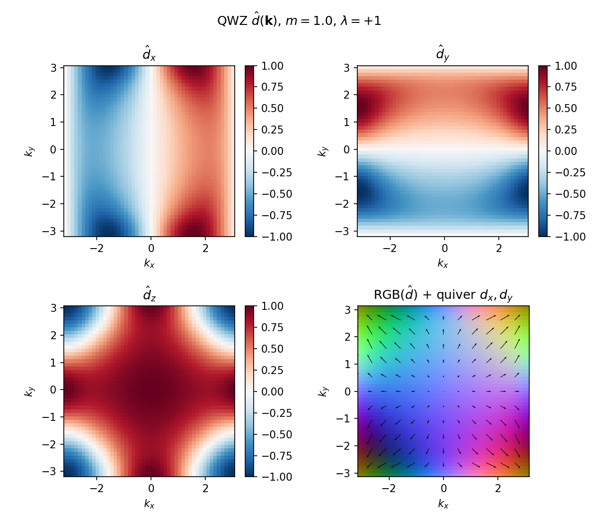
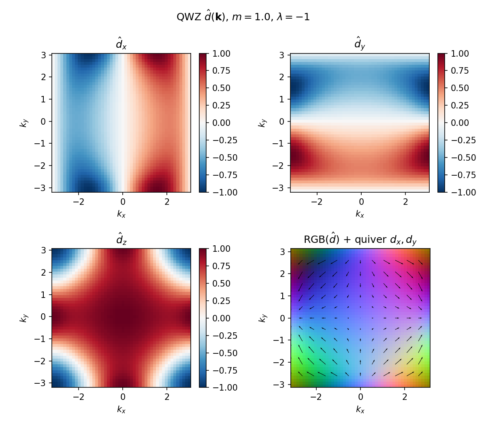
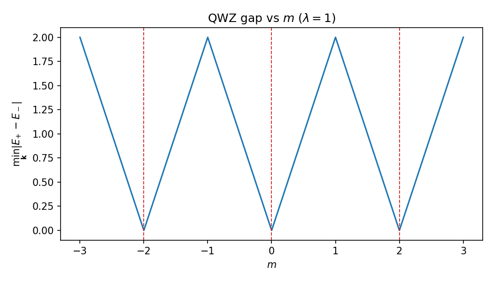
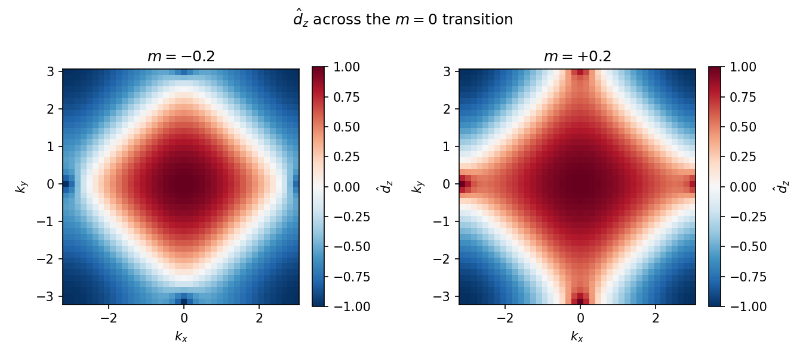

# Part 2 — Two-band models and the Bloch sphere

Part 1 gave you a one-orbital band. Topology in two dimensions needs at least two bands and a gap. The Qi–Wu–Zhang (QWZ) model is the workhorse of this series: two orbitals per site on the square lattice, written as a Bloch Hamiltonian $H(\mathbf{k})=\mathbf{d}(\mathbf{k})\cdot\boldsymbol{\sigma}$.

By the end of this part you will read a gapped two-band insulator as a unit-vector field $\hat{d}(\mathbf{k})$ on the Brillouin-zone torus, watch the gap close when a mass parameter is tuned, and see how the $\hat{d}$ texture changes across a critical point.

## QWZ as a map $\mathbf{k}\mapsto\hat{d}(\mathbf{k})$

The momentum-space QWZ Hamiltonian used throughout the repo is

$$
H(\mathbf{k}) = \sin k_x\,\sigma_x + \lambda\sin k_y\,\sigma_y + (m+\cos k_x+\cos k_y)\,\sigma_z.
$$

Default working point later: $m=1$, $\lambda=\pm 1$. The eigenvalues are $\pm|\mathbf{d}(\mathbf{k})|$, so the gap is open wherever $\mathbf{d}\neq 0$. The valence-band projector is completely fixed by the unit vector $\hat{d}=\mathbf{d}/|\mathbf{d}|$. Every gapped two-band insulator is therefore a continuous map from the BZ torus into the Bloch sphere.

Flipping $\lambda\to-\lambda$ reflects the $d_y$ component. That reflection reverses the orientation of the $\hat{d}$ map — a geometric foreshadowing of $C\to -C$ once we define the Chern number in Part 3. Numerically (`results/03_dhat.json`), $d_y(\lambda)=-\,d_y(-\lambda)$ to machine precision while $d_x$ and $d_z$ agree.

**Reproduce:** `python experiments/03_qwz_bloch_sphere.py`

## Gap closings and the mass parameter

Topology can only change when the gap closes. Sweeping $m$ at fixed $\lambda=1$, the minimum valence–conduction gap vanishes at the known QWZ critical values $m=0,\pm 2$:

At those critical points a Dirac cone appears at a high-symmetry momentum and the $\hat{d}$ texture reorganizes. Snapshots just below and above a transition:

From `results/04_gap.json`, the gaps at $m=-2,0,2$ are numerically zero (within floating-point noise). Away from criticality the system is a gapped insulator whose valence-band geometry we can integrate.

**Reproduce:** `python experiments/04_gap_closing.py`

---

**Next time:** Berry curvature and the Chern number — integrate the “magnetic field” of the Berry connection over the Brillouin zone and draw the $(m,\lambda)$ phase diagram.
