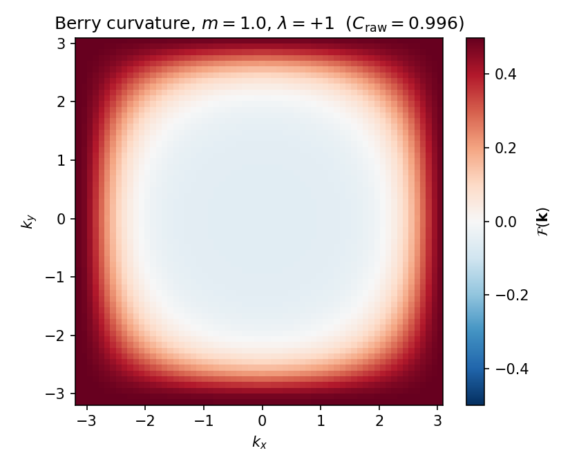
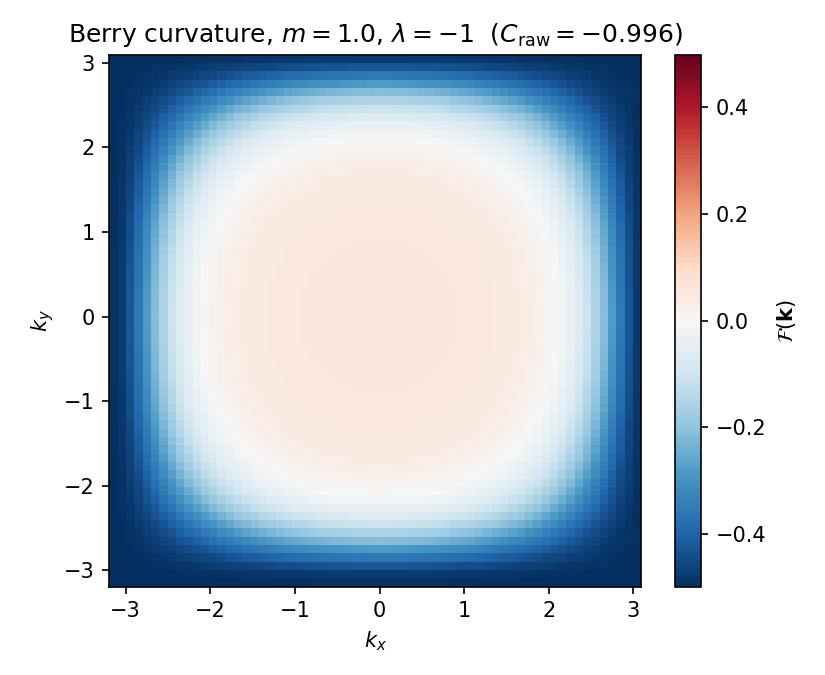
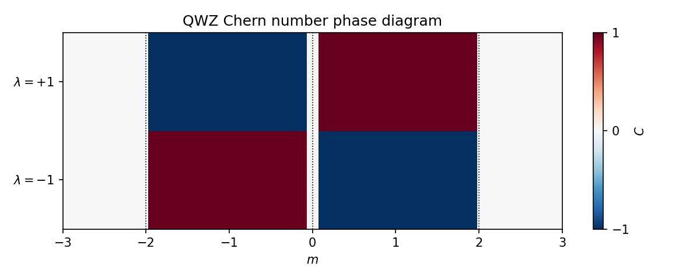

# Part 3 — Berry curvature and the Chern number

Part 2 left you with a unit-vector field $\hat{d}(\mathbf{k})$ on the Brillouin-zone torus. That field has a winding number. In condensed-matter language the winding is the Chern number $C$ of the valence band — the TKNN integer that will later refuse to sit quietly on a Möbius strip.

By the end of this part you will compute Berry curvature for QWZ, see it flip with $\operatorname{sgn}(\lambda)$, and read $C$ off a phase diagram.

## Berry connection and curvature

For an isolated band with Bloch state $|u(\mathbf{k})\rangle$, the Berry connection is the gauge-dependent vector

$$
\mathbf{A}(\mathbf{k}) = i\langle u|\nabla_{\mathbf{k}}|u\rangle,
$$

and the Berry curvature is its curl, $\mathcal{F}=\partial_{k_x}A_y-\partial_{k_y}A_x$. Think of $\mathbf{A}$ as a vector potential on the BZ and $\mathcal{F}$ as the associated magnetic field. Gauge changes shift $\mathbf{A}$ but leave $\mathcal{F}$ invariant when the gap is open.

For a two-band model $H=\mathbf{d}\cdot\boldsymbol{\sigma}$ there is a closed formula for the valence-band curvature,

$$
\mathcal{F}(\mathbf{k})=\frac{1}{2}\,\hat{d}\cdot\bigl(\partial_{k_x}\hat{d}\times\partial_{k_y}\hat{d}\bigr).
$$

On a discrete mesh the same integer is obtained from the Fukui–Hatsugai–Suzuki (FHS) link-variable method ([J. Phys. Soc. Jpn. **74**, 1674 (2005)](https://doi.org/10.1143/JPSJ.74.1674)). This series uses that discrete convention so the $k$-space Chern number matches the real-space marker later.

## Curvature of the QWZ valence band

At the default point $(m,\lambda)=(1,\pm 1)$, $\mathcal{F}$ concentrates near the would-be Dirac points and flips sign when $\lambda$ flips:

On a $64\times 64$ mesh (`results/05_berry.json`) the raw BZ integrals are $C_{\mathrm{raw}}\approx +0.996$ and $-0.996$ — visibly one quantum before integer rounding.

**Reproduce:** `python experiments/05_berry_curvature.py`

## Chern number and the phase diagram

The Chern number is the normalized flux of Berry curvature through the BZ:

$$
C=\frac{1}{2\pi}\int_{\mathrm{BZ}}\mathcal{F}\,d^2k\in\mathbb{Z}.
$$

Sweeping $m$ at $\lambda=\pm 1$ produces the familiar QWZ lobes (Qi, Wu & Zhang, [Phys. Rev. B **74**, 085308 (2006)](https://doi.org/10.1103/PhysRevB.74.085308)):

Labeled checks from `results/06_chern.json`:

| $(m,\lambda)$ | $C$ |
|---|---|
| $(1,+1)$ | $+1$ |
| $(1,-1)$ | $-1$ |
| $(0.5,+1)$ | $+1$ |
| $(3,+1)$ | $0$ |
| $(-3,+1)$ | $0$ |

In the lobe used for the rest of the series, $|m|<2$, one has $C=\operatorname{sgn}(\lambda)$. Large $|m|$ is a trivial insulator with $C=0$.

**Reproduce:** `python experiments/06_chern_phase_diagram.py`

---

**Next time:** Edges — bulk–boundary correspondence on a cylinder, where a nonzero bulk $C$ forces chiral modes you can plot.
