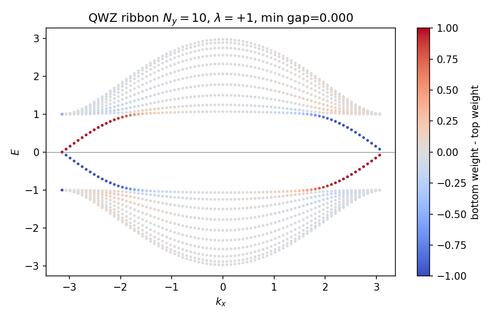
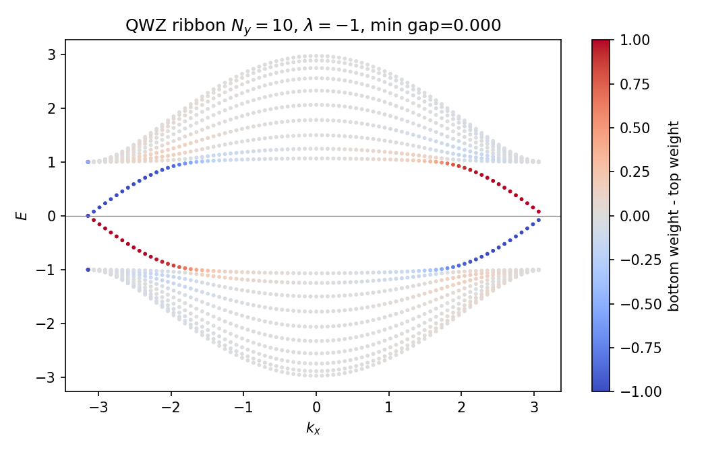
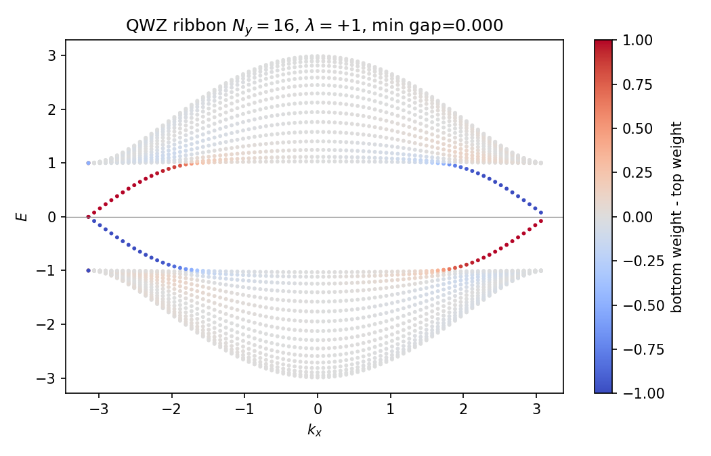
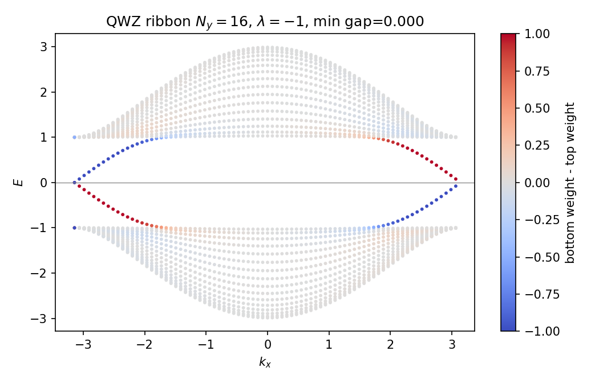
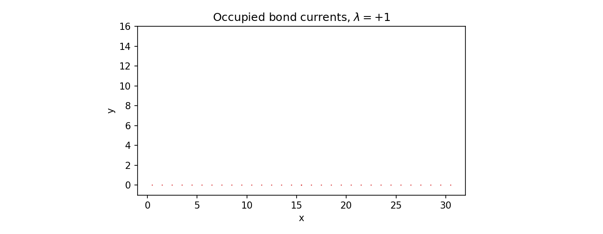
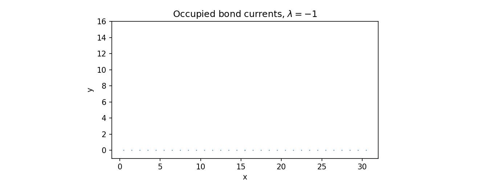

# Part 4 — Edges: bulk–boundary on a cylinder

A nonzero bulk Chern number is not just a label on a phase diagram. On a sample with a boundary it forces chiral edge modes: that is bulk–boundary correspondence in one sentence. The cleanest geometry is a cylinder — periodic in $x$, open in $y$ — so $k_x$ remains a good quantum number while the edges are physical.

By the end of this part you will predict the chirality of edge modes from $\operatorname{sgn}(\lambda)$, see finite-width hybridization, and recover the same physics as occupied-state bond currents in real space.

## Cylinder edge spectrum

Build real-space QWZ on a cylinder and plot eigenvalues versus $k_x$, coloring points by how much weight sits on the top versus bottom few rows. For $\lambda=+1$ one edge disperses one way and the opposite edge the other way; flipping $\lambda$ reverses both chiralities.

Counter-propagating edges on opposite sides can hybridize through the bulk. On $N_y=10$ the hybridization scale is $\sim 3\times 10^{-12}$; on $N_y=16$ it drops to $\sim 10^{-20}$ (`results/07_edges.json`). That is why $N_y=16$ is the default width later in the series.

**Reproduce:** `python experiments/07_cylinder_edges.py`

## Occupied-state edge currents

The same chirality appears without using $k_x$: fill the valence sea, form the occupied density matrix $\rho$, and compute Hermitian bond currents

$$
I_{ij}=2\,\mathrm{Im}\bigl(t_{ji}\rho_{ij}\bigr).
$$

Plotting arrows on the unrolled cylinder:

Mean edge currents reverse with $\lambda$; bulk bonds average to numerical zero (`results/08_currents.json`). These maps are the orientable warm-up for the Huang–Lee Möbius current patterns in Part 7.

**Reproduce:** `python experiments/08_cylinder_currents.py`

---

**Next time:** Laughlin’s pump where it works — thread flux through the cylinder hole and meet the local Chern marker.
