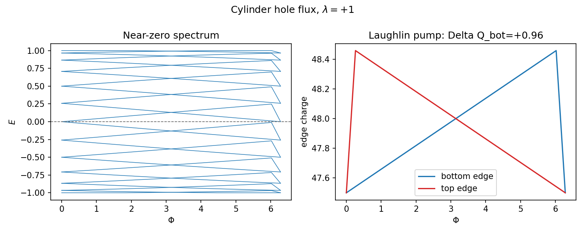
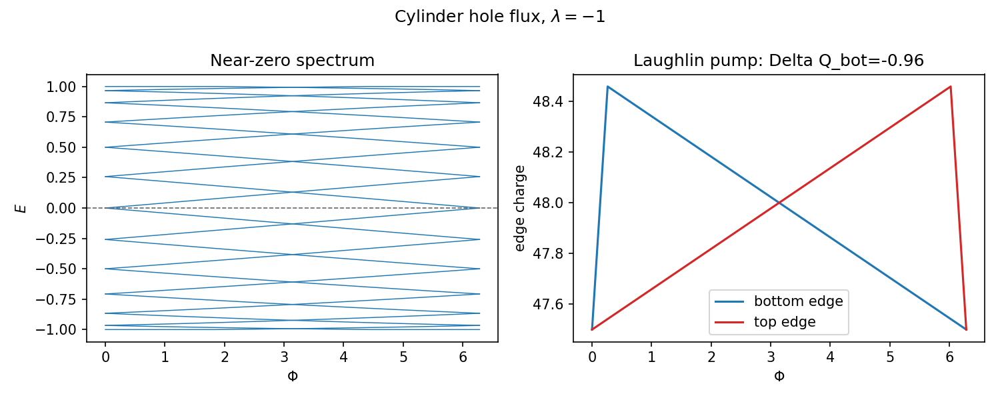
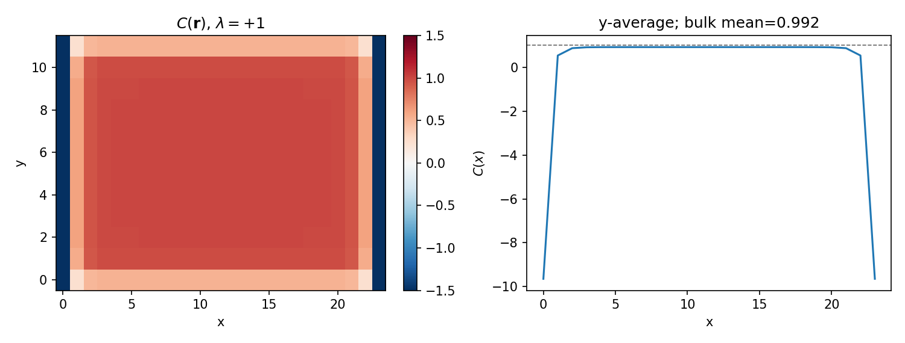
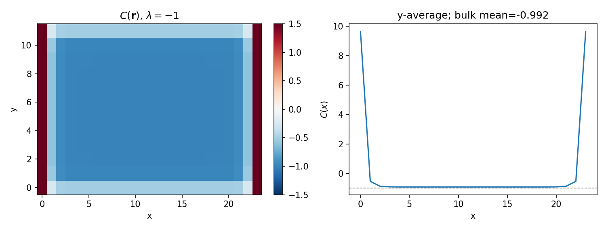

# Part 5 — Laughlin’s pump (where it works)

Laughlin’s gauge argument says that adiabatically threading one flux quantum through a cylinder of a Chern insulator pumps one electron from one edge to the other when $|C|=1$. This part shows that pump *succeeding*, so that Part 10’s failure on a Möbius strip is meaningful rather than mysterious.

By the end of this part you will read a flux-sweep spectrum for signed charge transfer and meet the Bianco–Resta local Chern marker on an orientable geometry where the answer is known.

## Hole-flux spectral flow on a cylinder

Implement the flux by a Peierls twist on all $+x$ hoppings, $\Phi\in[0,2\pi]$. Track eigenvalues near $E=0$ and — more robustly than counting fragile zero crossings of hybridized levels — the signed **edge charge** on the bottom rows. The pumped charge over one flux quantum is

$$
\Delta Q = Q_{\mathrm{bot}}(\Phi{=}2\pi)-Q_{\mathrm{bot}}(\Phi{=}0),
$$

and it should equal $\operatorname{sgn}(\lambda)$ (up to finite-size residual).

From `results/09_laughlin.json` (cylinder $N_x=24$, $N_y=12`): pumped charge $\approx +0.96$ for $\lambda=+1$ and $\approx -0.96$ for $\lambda=-1$, with signed crossing counts $+1$ and $-1$. One charge’s worth of spectral flow per flux quantum; no anticrossing that cancels the pump. (Laughlin, [Phys. Rev. B **23**, 5632(R) (1981)](https://doi.org/10.1103/PhysRevB.23.5632).)

**Reproduce:** `python experiments/09_laughlin_cylinder.py`

## Bianco–Resta local Chern marker

Global $C$ is a BZ integral. Disordered or inhomogeneous systems need a **local** density of Chern number. Bianco and Resta define a site-resolved marker from the occupied projector $P$ ([Phys. Rev. B **84**, 241106(R) (2011)](https://doi.org/10.1103/PhysRevB.84.241106)):

$$
C(\mathbf{r})=-2\pi\,\mathrm{Im}\,\bigl\langle\mathbf{r}\big|P\bigl[[X,P],[Y,P]\bigr]\big|\mathbf{r}\bigr\rangle.
$$

On a cylinder, $X$ and $Y$ are ordinary Cartesian coordinates (minimal-image in the periodic $x$ direction). Averaging over $y$ away from the open edges gives a bulk plateau:

Bulk means from `results/10_marker.json`: $\approx +0.992$ for $\lambda=+1$ and $\approx -0.992$ for $\lambda=-1$ (residual $\sim 0.008$ versus $\operatorname{sgn}\lambda$). Edge sites deviate — expected. This is the convention locked for the rest of the repo; Möbius charts come later.

**Reproduce:** `python experiments/10_local_marker_cylinder.py`

---

**Next time:** Domain walls and Jackiw–Rebbi — let $C$ jump in space and count co-propagating wall modes on a cylinder.
