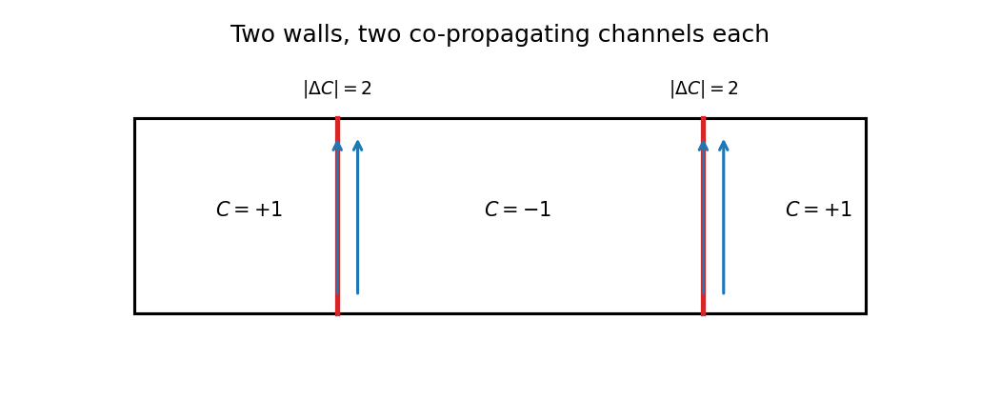
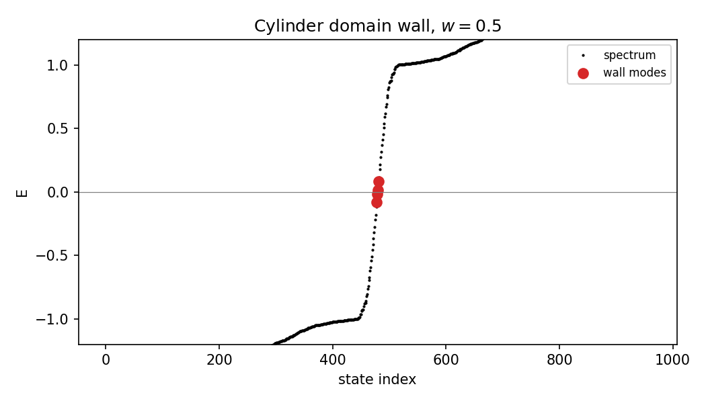
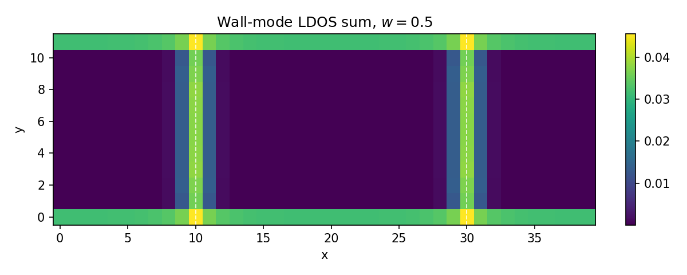
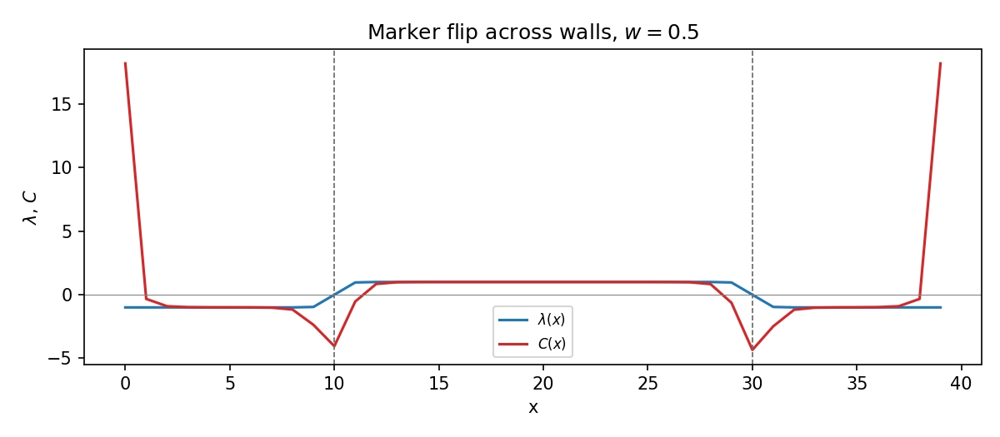
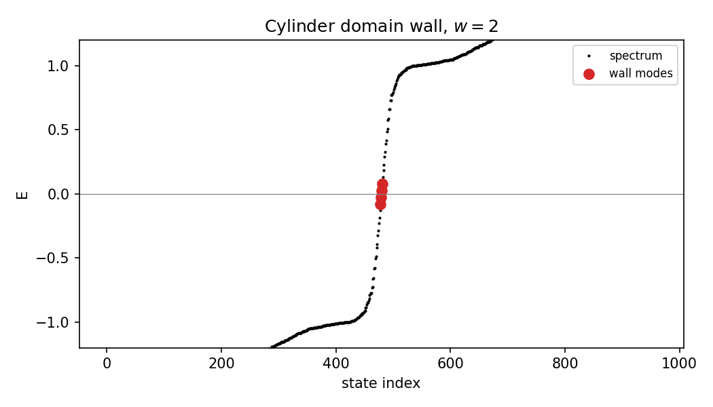
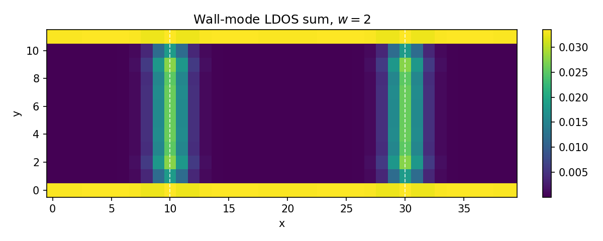
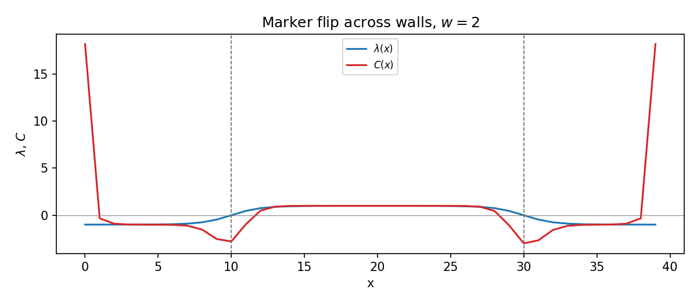
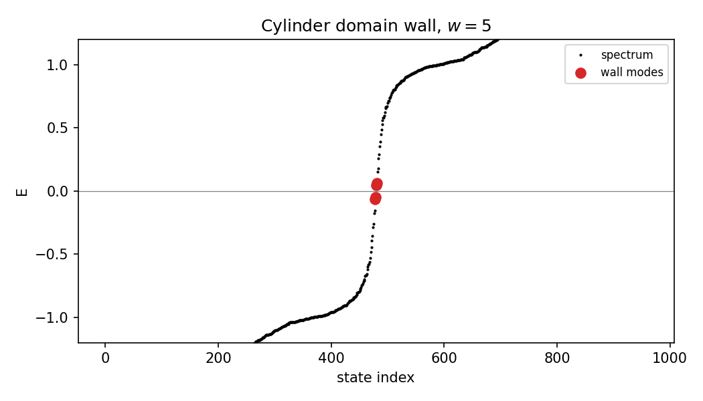
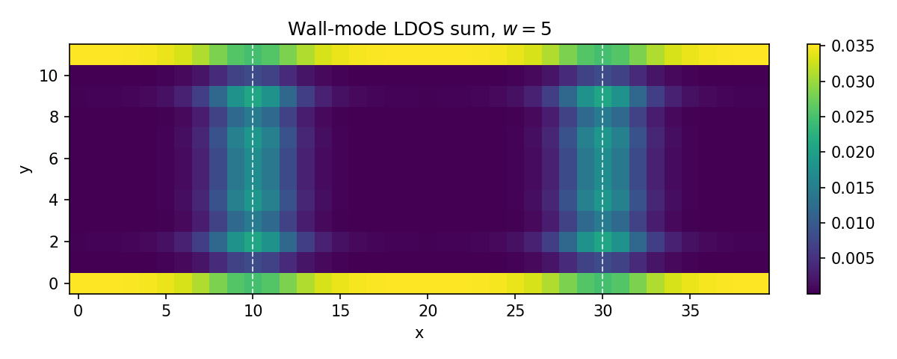
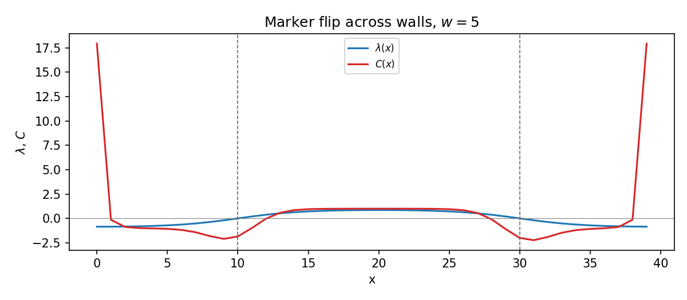

# Part 6 — Domain walls and Jackiw–Rebbi

Parts 3–5 treated a *uniform* Chern insulator. If the Chern number jumps in space, the interface binds $|\Delta C|$ chiral modes — the lattice avatar of a Jackiw–Rebbi domain wall. On a cylinder, a smooth mass profile that flips $\operatorname{sgn}(\lambda)$ twice per circuit creates **two** walls. That double-wall geometry is the orientable dress rehearsal for the single seam on a Möbius strip.

By the end of this part you will build $\lambda(x)=\lambda_0\tanh((x-x_0)/w)$, count co-propagating wall channels, and watch the local marker flip across each wall.

## A chirality wall on a cylinder

Take

$$
\lambda(x)=\lambda_0\tanh\bigl((x-x_0)/w\bigr)
$$

with periodic identification in $x$. Because the cylinder is a loop, there are two zeros per circuit and therefore two walls. For QWZ with $C=\operatorname{sgn}(\lambda)$, each wall has $|\Delta C|=2$, so Jackiw–Rebbi counting predicts **two co-propagating** modes per wall — four in-gap wall modes in total.

## Spectrum, LDOS, and $C(x)$

For wall widths $w\in\{0.5,2,5\}$ the in-gap spectrum, wall-localized LDOS, and $y$-averaged marker $C(x)$ all tell the same story:

From `results/11_domain_wall.json` (primary $w=2$): four in-gap modes, two per wall, co-propagating on each wall (same-sign wall currents); marker plateaus $\approx +1$ and $\approx -1$ with a clear flip across each wall. Integer shifts of $x_0$ leave the spectrum unchanged to machine precision — a lattice glide, not a physical deformation (unit test, never a figure).

**Reproduce:** `python experiments/11_domain_wall_cylinder.py`

---

**Next time:** Onto a Möbius strip — glue with a $y$-reversal, reproduce Huang–Lee currents, and cite the prior art honestly.
