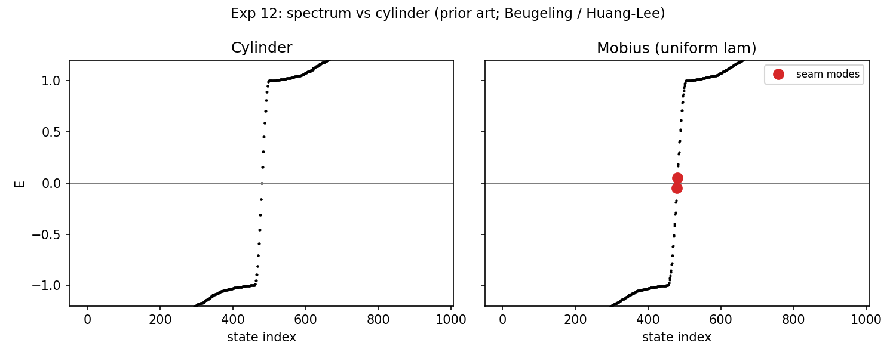
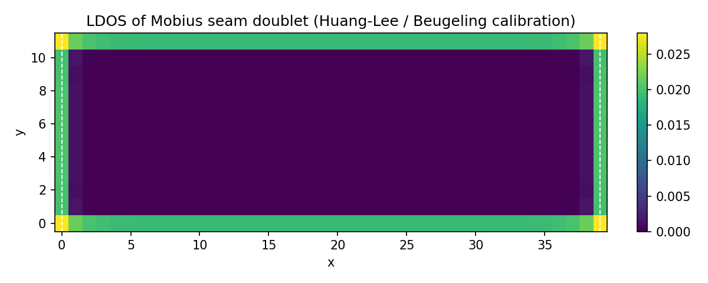
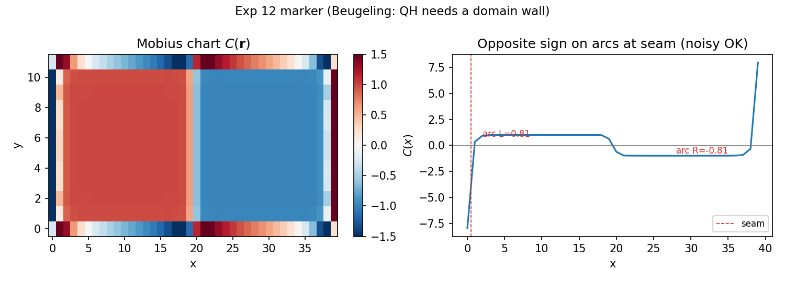
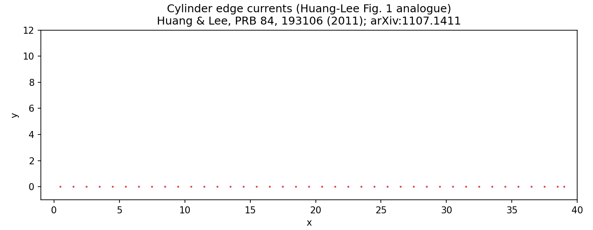
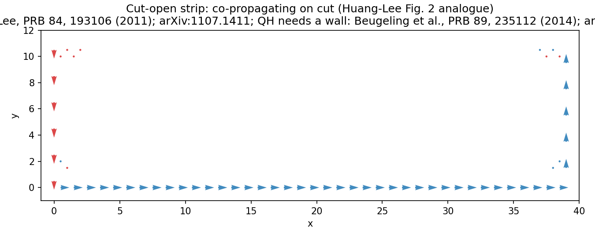
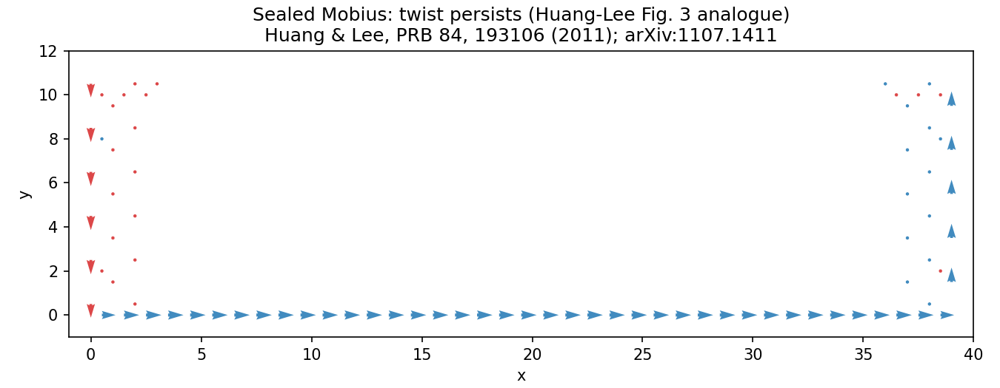
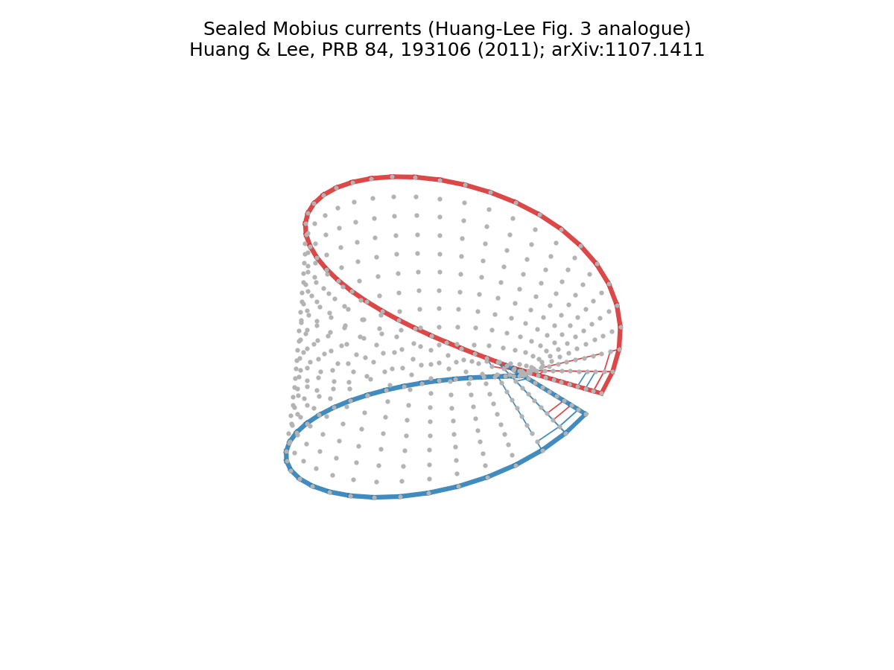
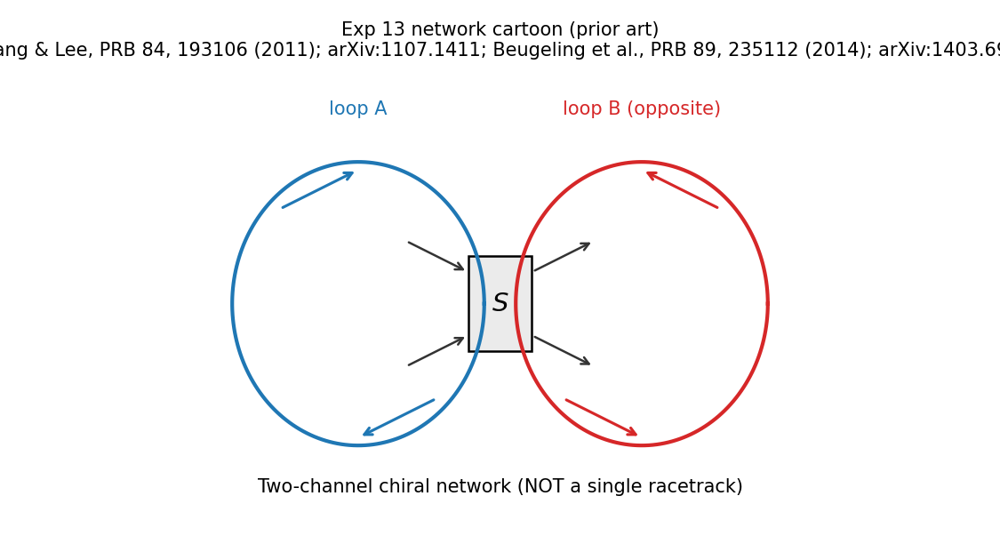

# Part 7 — Onto a Möbius strip (prior art)

Parts 1–6 built Chern physics on an *orientable* cylinder. A Möbius strip is different: one twist in the gluing, and there is no globally consistent choice of “up.” The domain wall, the co-propagating seam modes, and the twisted edge-current pattern on that geometry are **prior art**. This part reproduces them as calibration. It does not claim them as new.

By the end of this part you will glue QWZ with a $y$-reversal, find the seam-localized in-gap doublet, and match the current patterns of Huang & Lee.

## Why a Möbius strip needs a wall

On a non-orientable band a global Chern number (and a uniform Hall conductivity) cannot be defined smoothly: the Chern density is parity-odd and orientation-dependent. Beugeling, Quelle, and Morais Smith emphasize that local quantum-Hall physics on a Möbius strip therefore requires an orientation flip — a chirality **domain wall** ([Phys. Rev. B **89**, 235112 (2014)](https://doi.org/10.1103/PhysRevB.89.235112); [arXiv:1403.6998](https://arxiv.org/abs/1403.6998)).

Huang and Lee studied related Möbius Chern / quantum-spin-Hall setups and showed how edge currents detect the twist ([Phys. Rev. B **84**, 193106 (2011)](https://doi.org/10.1103/PhysRevB.84.193106); [arXiv:1107.1411](https://arxiv.org/abs/1107.1411)). Their Figs. 1–3 are the qualitative benchmarks for the current maps below.

The “inverted Möbius strip” as a Hamiltonian is not a deformed embedding. It is a gluing rule plus an orientation-odd coupling.

## Möbius gluing and a sharp seam wall

Sites $(x,y)$ with open $y$. Cylinder gluing was $(N_x,y)\to(1,y)$. Möbius gluing is

$$
(N_x,y)\longrightarrow\bigl(1,\,N_y+1-y\bigr).
$$

The $y$-hopping $\propto\lambda\sigma_y$ is odd under $y\to -y$, so consistent monodromy requires $\lambda(x+L)=-\lambda(x)$. With **uniform** $\lambda$ and Möbius gluing, the geometric **seam** itself is the domain wall.

From `results/12_mobius_sharp.json` ($N_x=40$, $N_y=12$): two in-gap seam modes at $E\approx\pm 0.050$, localized on the seam; arc-averaged markers $\approx +0.81$ and $\approx -0.81$ on the two sides meeting there (noisy but opposite in sign). Do not read this as a first observation of Möbius Chern edge modes — it is the expected Jackiw–Rebbi / orientation-obstruction signature on this geometry.

**Reproduce:** `python experiments/12_mobius_sharp_wall.py`

## Reproduce Huang–Lee currents

Occupied (or small-bias) bond currents on three panels, plus a 3D embedding — qualitative analogues of Huang–Lee Figs. 1–3:

1. Cylinder (orientable reference).
2. Möbius with the seam cut open: co-propagating currents on the cut after accounting for the $y$-flip.
3. Möbius with the cut sealed: the twist remains visible in the current pattern.

With $C=+1$ on one arc and $C=-1$ on the other, the edge plus wall form **two loops** that encircle the hole in opposite directions, coupled at a 2-in/2-out junction with a unitary $S$-matrix. A single racetrack is only the special case of off-diagonal $S$. The series keeps that network picture from here on.

`results/13_huang_lee.json` records the pass criteria and cites Huang–Lee / Beugeling explicitly: this is a reproduction, not a novelty claim.

**Reproduce:** `python experiments/13_currents_huang_lee.py`

---

**Next time:** The Hall vector field — why a scalar Chern density cannot be painted on a non-orientable surface, and why $\mathbf{h}=C\hat{n}$ can.
