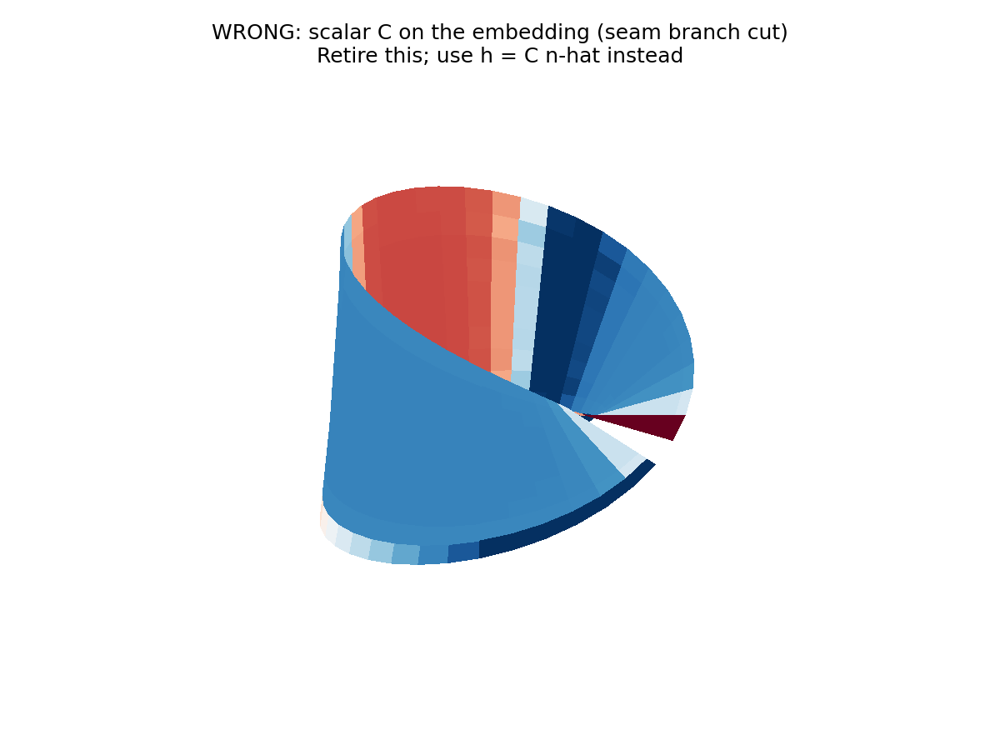
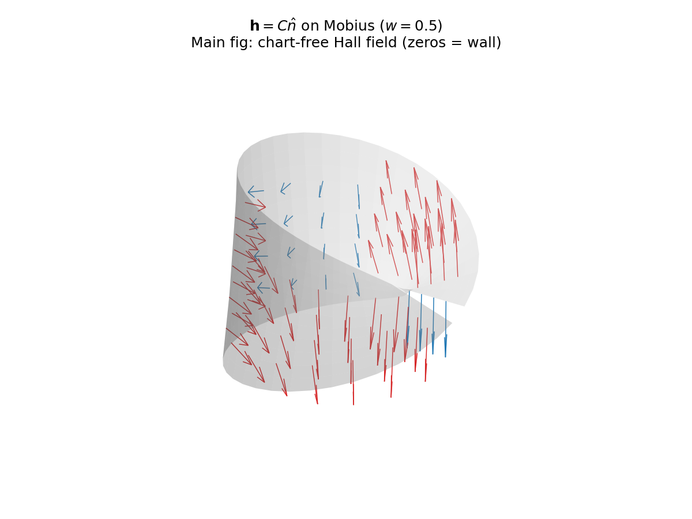
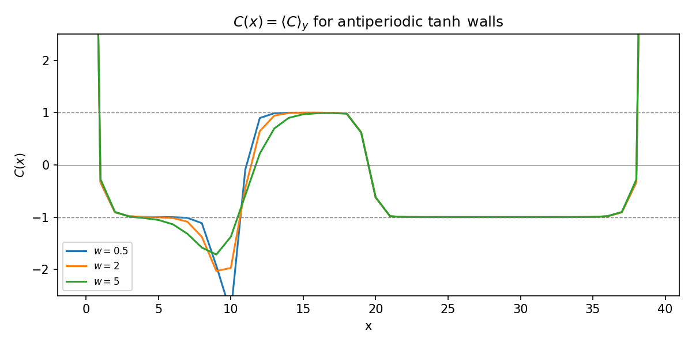

# Part 8 — The Hall vector field

Part 7 calibrated against prior art: the Möbius seam wall and the twisted current pattern are known. What this series adds, starting here, is a chart-free way to *see* the orientation obstruction on the embedded strip.

The Chern density $C(\mathbf{r})$ is a **pseudoscalar**: it flips under a change of orientation chart. The surface normal $\hat{n}(\mathbf{r})$ is a **pseudovector**: it flips under the same change. Their product

$$
\mathbf{h}(\mathbf{r})=C(\mathbf{r})\,\hat{n}(\mathbf{r})
$$

is an ordinary vector. Paint $\mathbf{h}$ as arrows on the embedding and the branch cut disappears. A one-line obstruction theorem then locates the wall: a nowhere-vanishing continuous normal field would orient the surface; the Möbius strip has none; therefore $\mathbf{h}$ must vanish somewhere — and that zero *is* the chirality wall.

By the end of this part you will compute $C(\mathbf{r})$ in a Möbius chart, form $\mathbf{h}$, and watch it softens on a band whose width tracks the wall smearing $w$.

## The wrong plot first: scalar $C$ on the embedding

Using the per-site Möbius chart from Part 7 (minimal-image $\mathrm{d}x$, $y$ flipped across the seam), compute Bianco–Resta $C(\mathbf{r})$ for an antiperiodic $\tanh$ profile at several $w$. Painting $C$ as a scalar color on the 3D strip inevitably shows a branch cut at the seam — the surface is non-orientable, so a global scalar Chern density cannot be continuous:

Retire this visualization after one look. It is a diagnostic of the chart problem, not the physical field.

## Arrows of $\mathbf{h}=C\hat{n}$

Build the standard Möbius embedding and its normals from $\partial_u\times\partial_v$ in the matching chart. Form $\mathbf{h}=C\hat{n}$. For wall widths $w\in\{0.5,2,5\}$:

From `results/14_hall_vector.json` (primary $w=2$): bulk plateaus $\langle C\rangle\approx +0.996$ and $-1.000$; $|\mathbf{h}|$ on the plateaus is order one while it is suppressed on the wall; relative jump of $|\mathbf{h}|$ across the seam is $\sim 10^{-5}$–$10^{-4}$ (continuous within marker noise). Soft width tracks $w$.

The honest novelty line for Parts 8–11: *the wall is known; we treat the obstruction as a Hall vector field on the embedding and contrast global vs local Laughlin pumping, including smearing and a disordered antiperiodic $\lambda$.*

**Reproduce:** `python experiments/14_hall_vector.py`

---

**Next time:** Can you smooth the inversion away? — measure the junction scale $S_{12}(w,N_y)$ and ask whether adiabatic walls decouple the two channels.
