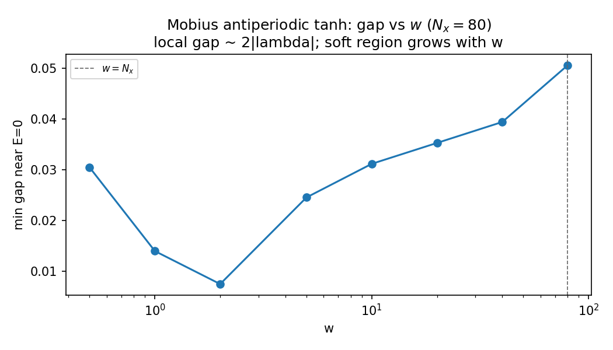
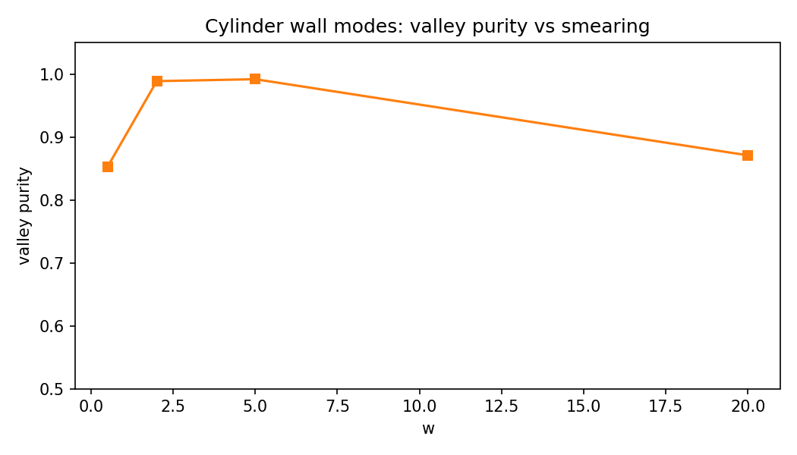
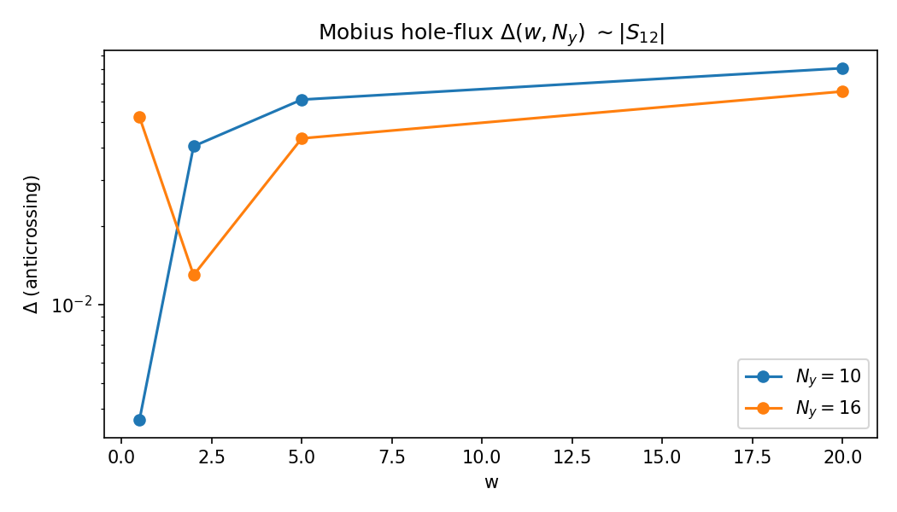

# Part 9 — Can you smooth the inversion away?

Part 8 located the wall as a zero of the Hall vector field $\mathbf{h}$. A natural objection follows: maybe a sufficiently smeared $\tanh$ profile softens the inversion until nothing is left. This part measures what actually happens.

The local bulk gap still tracks $\sim 2|\lambda(x)|$. Smearing widens the *region* where that local gap is soft; only $w\gtrsim N_x$ makes the whole strip wall-like. Separately, the two wall channels form a junction with a unitary $S$-matrix. On the Möbius strip the hole-flux anticrossing gap $\Delta$ tracks $|S_{12}|$. Whether $|S_{12}|\to 0$ as $w$ grows is an experimental question — answered here numerically, not by fiat.

By the end of this part you will read gap-vs-$w$, cylinder valley purity, and a $\Delta(w,N_y)$ family of curves as a map of twist-induced mixing.

## Local gap versus smearing

On the Möbius strip with antiperiodic $\lambda(x)$ ($N_x=80$), the minimum spectral gap near $E=0$ varies with $w$ but does not collapse “everywhere”:

Selected values from `results/s_matrix.md` / `results/15_smearing_S.json`:

| $w$ | gap |
|---|---|
| 0.5 | 0.030 |
| 2 | 0.007 |
| 5 | 0.025 |
| 20 | 0.035 |
| 80 | 0.051 |

The soft (wall-like) region grows with $w$; fully wall-like requires $w\gtrsim N_x$.

## Cylinder valley purity

The two QWZ Dirac points at $k_y=\pm\pi/2$ are locally distinct valleys. Project in-gap wall states onto $\sin k_y$ and ask whether they stay valley-pure as $w$ increases (periodic $\tanh$, two walls on a cylinder):

Mean majority-valley weights stay high (e.g. $\approx 0.99$ at $w=2$ and $5$; still $\gtrsim 0.85$ at $w=0.5$ and $20$). Cylinder walls do **not** force strong valley mixing merely by smearing.

## Möbius anticrossing $\Delta(w,N_y)$

Thread hole flux on the Möbius strip and extract

$$
\Delta=\min_{\Phi}\bigl[E_1(\Phi)-E_0(\Phi)\bigr]
$$

for the two levels closest to zero. In the two-loop network picture, $\Delta$ tracks $|S_{12}|$:

Every $(w,N_y)$ pair in the grid is an avoided crossing (finite $\Delta$), not a quantized gap crossing. Example: $(w,N_y)=(0.5,10)$ gives $\Delta\approx 3.6\times 10^{-3}$; $(2,16)$ gives $\Delta\approx 1.3\times 10^{-2}$; larger $w$ does not drive $\Delta\to 0$.

**Interpretation.** Cylinder wall modes remain relatively valley-pure while Möbius hole flux still shows a finite $\Delta$. That points to **twist-induced mixing** at the junction (finite $|S_{12}|$), not mere smearing of the mass profile.

Integer glides $x_0\to x_0+1$ leave eigenvalues unchanged to $\sim 10^{-15}$ (`glide_max_dE` in `results/15_smearing_S.json`) — a unit-test fact, not a spectrum-vs-$x_0$ figure.

**Reproduce:** `python experiments/15_smearing_and_S.py`

---

**Next time:** Eigenvalues of the inverted strip — global Laughlin fails on the Möbius hole; a local flux tube still pumps, and flips across the wall.
