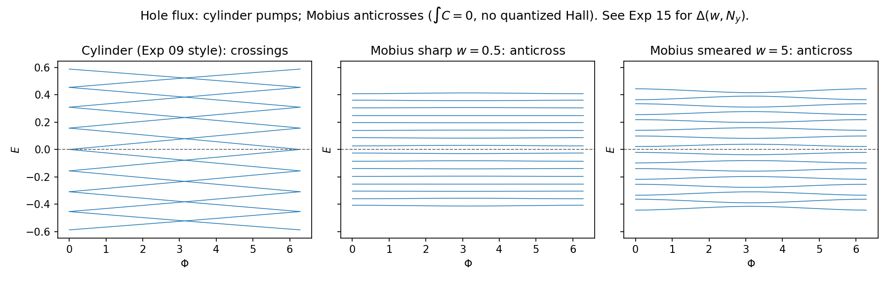
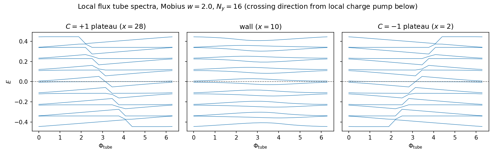
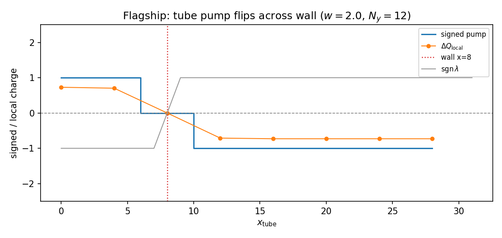

# Part 10 — Eigenvalues of the inverted strip

Part 1 parked Tony Stark’s line about eigenvalues of an inverted Möbius strip. This part is that figure — earned by first showing Laughlin pumping *succeed* on a cylinder (Part 5), then watching the same knob fail globally and succeed locally on the Möbius strip.

Laughlin’s argument assumes a globally defined Chern number. On the Möbius strip $C$ is a section of a nontrivial line bundle: it integrates to zero around the loop. Threading flux through the **hole** therefore cannot pump a net Hall charge. Topology is still local: a $2\pi$ flux **tube** through one plaquette pumps with direction $\operatorname{sgn} C(x_{\mathrm{tube}})$, and that direction flips when the tube crosses the wall.

By the end of this part you will read anticrossings (not crossings) in the hole-flux spectrum, and the flagship signed-crossing line plot versus tube position.

## Global Laughlin fails: hole flux on Möbius

Same Peierls hole-flux sweep as Experiment 09, different geometry. Side-by-side with the successful cylinder:

From `results/16_laughlin_hole_mobius.json`:

- Möbius sharp wall ($N_y=16$, $w=0.5$): signed crossings $0$, anticrossing scale $\Delta\approx 0.052$, closest approach to $E=0$ about $0.026$.
- Möbius smeared ($N_y=16$, $w=5$): signed crossings $0$, $\Delta\approx 0.043$.
- Möbius smeared ($N_y=10$, $w=5$): signed crossings $0$, $\Delta\approx 0.061$.

Levels approach, anticross, and retreat. Net Hall response to flux through the hole vanishes because $C$ as a section integrates to zero. The anticrossing scale is the $\Delta$ of Part 9 / Experiment 15. **Do not** caption this as the pumped charge “returning via the wall.”

**Reproduce:** `python experiments/16_laughlin_hole_mobius.py`

## Local Laughlin works: flux tube through a plaquette

Insert a $2\pi$ flux tube at $x_{\mathrm{tube}}$ (Peierls string to the open edge, consistent with Möbius $y$-reversal if the string hits the seam). Sweep $\Phi_{\mathrm{tube}}$ from $0$ to $2\pi$ and record the signed charge pump near the tube. Then slide $x_{\mathrm{tube}}$ along the ring through the wall.

From `results/17_laughlin_tube.json`:

- Line sweep ($N_x=32$, $N_y=12$, $w=2$): signed pump $+1$ on the positive arc, $0$ on the wall column, $-1$ on the negative arc.
- Grid over $w\in\{0.5,2,5\}$ and $N_y\in\{10,16\}$: plateau pumps have magnitude $\sim 0.7$–$0.74$ (finite-size residual versus ideal $\pm 1$) with opposite signs on opposite arcs; wall site consistently reports $0$.

Near the wall the counts are messy — that mess *is* the finite wall width, not a bug. Naive eigsh zero-crossing tallies can cancel under particle–hole symmetry; the signed local charge pump is the robust observable (same lesson as Part 5).

The “inverted strip” is the family of Hamiltonians with a smeared, movable chirality wall. The eigenvalues that know about the inversion are these **local** spectral flows, not the hole-flux sweep.

**Reproduce:** `python experiments/17_laughlin_tube.py`

---

**Next time:** Odd zeros without a $\tanh$ — disordered antiperiodic $\lambda(x)$ still forces an odd number of Hall-vector zeros.
