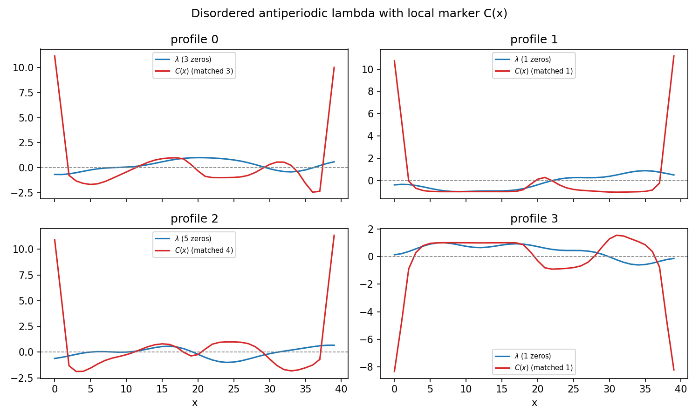
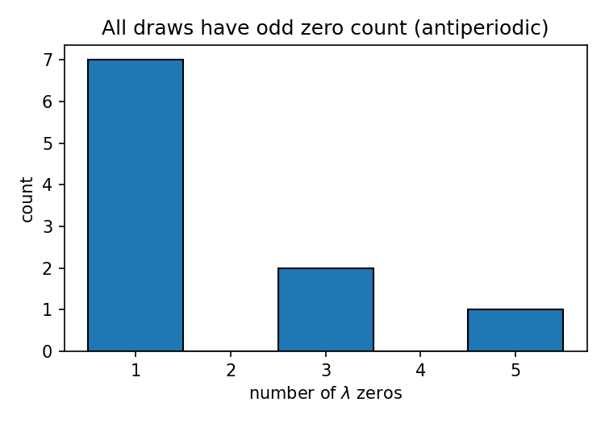
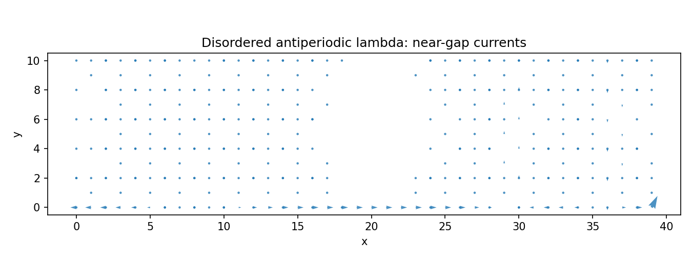

# Part 11 — Odd zeros without a tanh

The $\tanh$ wall was a convenience. The topological fact is that an antiperiodic $\lambda$ — a section of the Möbius line bundle over the circle — has an **odd** number of zeros. Those zeros are where $\mathbf{h}$ must vanish. Random antiperiodic profiles should still force an odd number of walls. This part is a robustness coda, not a second flagship.

By the end of this part you will see disordered $\lambda(x)$ with odd zero counts, matching marker walls, and one current map that still shows the twist.

## Drawing antiperiodic disorder

Generate smooth random profiles that obey $\lambda(x+L)=-\lambda(x)$ by construction — here, Fourier series retaining only odd harmonics (seed fixed in `results/18_disordered_lambda.json` so the figures reproduce). Smoothness keeps the local gap from being shredded; the topology does not care about the $\tanh$ shape.

## Odd zeros, matching walls

For each of ten profiles, count zeros of $\lambda$ and sign changes / zeros of the $y$-averaged marker $C(x)$ (equivalently, soft regions of $\mathbf{h}$):

From `results/18_disordered_lambda.json` ($N_x=40$, $N_y=12$, ten profiles, `rng_seed=20260321`): every draw has an odd number of $\lambda$ zeros ($1$, $3$, or $5$); marker/current walls match that count within resolution (`pass_all_odd`, `pass_marker_match`). There is no even-zero “control” with periodic $\lambda$ — that would simply be a cylinder (Parts 4–6).

**Reproduce:** `python experiments/18_disordered_lambda.py`

## Coda

A Chern insulator cannot be inverted by a continuous deformation: $C\to -C$ is a jump. A Möbius strip cannot be given a continuous orientation. Put them together and the orientation-odd coupling that sets $\operatorname{sgn} C$ cannot be defined globally; it is a section of a nontrivial line bundle and must vanish an odd number of times. That zero is the chirality domain wall.

Huang & Lee and Beugeling, Quelle & Morais Smith taught the wall, the co-propagating modes, and the current twist ([arXiv:1107.1411](https://arxiv.org/abs/1107.1411); [arXiv:1403.6998](https://arxiv.org/abs/1403.6998)). This series reproduced them as calibration, then added: the obstruction as a Hall vector field $\mathbf{h}=C\hat{n}$ on the embedding; a two-channel junction whose mixing scale survives smearing; global Laughlin failure versus local tube success; and odd zeros without a $\tanh$.

The eigenvalues of the inverted strip are local spectral flows that flip across the wall — not a hole-flux plot that pretends a global Chern number still exists.
